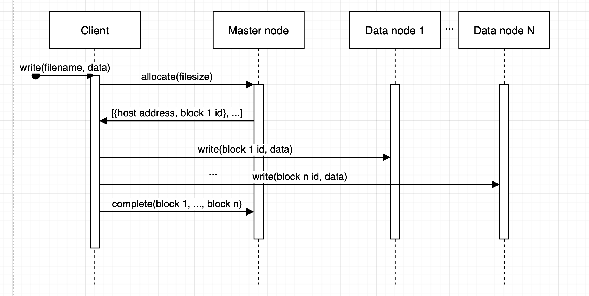
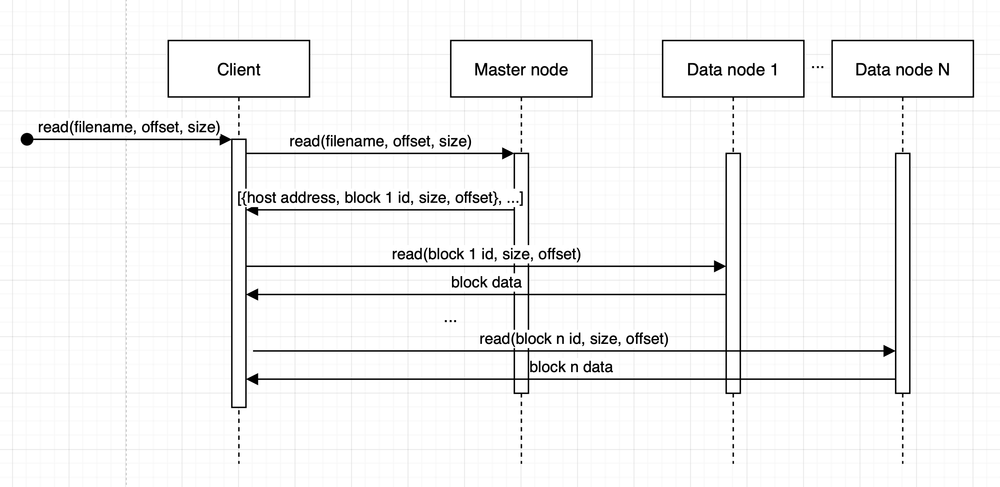

# Лабораторная работа №4

- **Студент:** Наумов Павел
- **Группа:** P3318
- **ИСУ:** 367428

---

# GFS

В данной лабораторной работе реализована упрощенная версия Google fle system. Система состоит из 2 компонентов: master node и data node. 

## Master node

Master node отвечает за метаданные, запускается в 1 экземпляре. В этой файловой системе файлы состоят из блоков одинакового размера (в данный момент выбран размер 8 байт для большей наглядности). Master node хранит отображения файла в блоки, блоки в data node хосты, и обратное отображение data node хосты в блоки, которые хранит хост. Master node имеет 4 функции:

* register(host, blocks...) - зарегистрировать хост data node, который имеет такие блоки
* assign(size) -> [{host, blockid}, ...] - выделить N блоков, суммарный размер которых >- size, присвоить этим блокам глобально уникальные id, и выбрать хосты для этих блоков. Хосты выбираются так, чтобы количество блоков у хостов было как можно более одинаково
* complete(filename, blocks...) - Добавить в отображение файла новые блоки. Эти блоки должны быть предварительно выделены и записаны на соответствующие data node-ы.
* read(filename, offset, size) -> [{host, block id, size, offset}, ...] - возвращает список, для чтения size байт файла filename с отступом offset, из четверок хост, ид блока, размер, который надо прочитать в блоке, отступ в блоке. Э

## Data node

Data node отвечает за хранение и отдачу блоков данных. При запуске, data node берет все блоки, которые у нее есть, и регистрирует себя в master node. Data node имеет 2 функции:

* write(block id, data) - записать новый блок данных
* read(block id, size, offset) - вернуть size байт данных блока block id начиная с offset

## Чтение и запись

